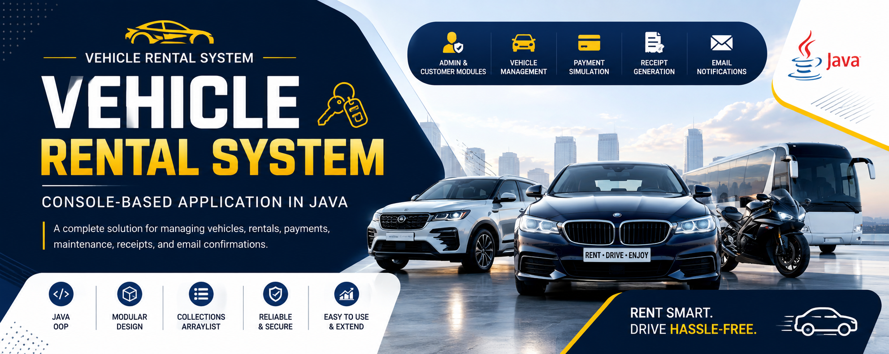
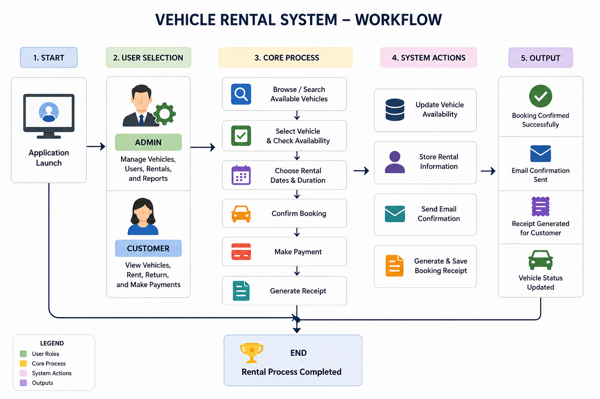
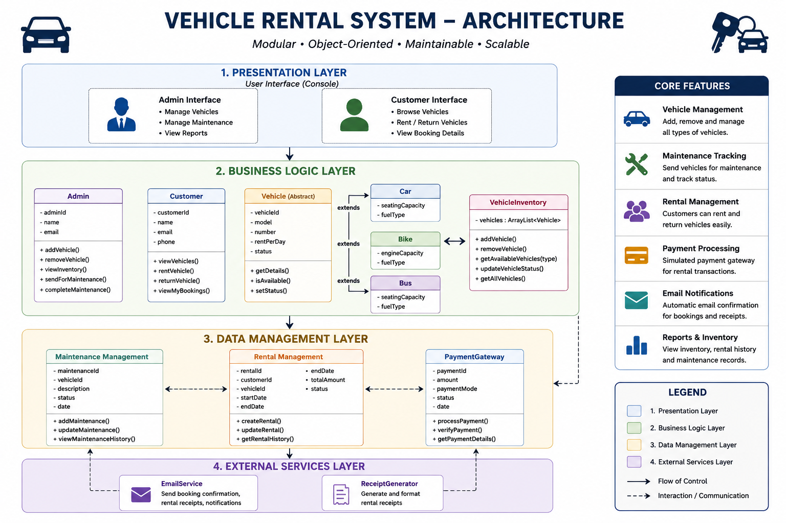
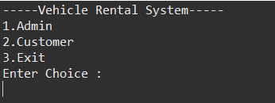
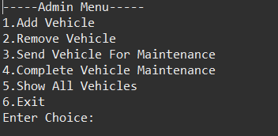
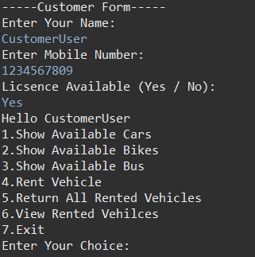
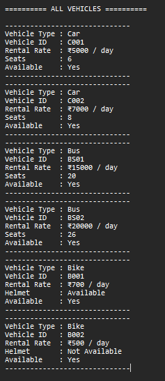
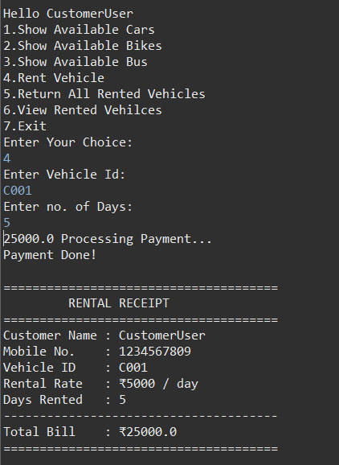
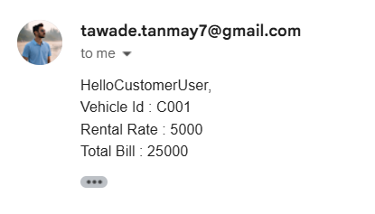

<p align="center">
  
</p>

<h1 align="center">🚗 Vehicle Rental System</h1>

<p align="center">
<b>A Console-Based Vehicle Rental Management System built with Java and Object-Oriented Programming.</b>
</p>

<p align="center">
The application simulates the workflow of a real-world vehicle rental service with dedicated <b>Admin</b> and <b>Customer</b> modules, vehicle inventory management, maintenance tracking, payment simulation, receipt generation, and email notifications.
</p>

---

<p align="center">


</p>

---

# 📌 Project Highlights

| Feature | Status |
|:---------|:------:|
| Admin Module | ✅ |
| Customer Module | ✅ |
| Vehicle Inventory | ✅ |
| Vehicle Maintenance | ✅ |
| Payment Simulation | ✅ |
| Receipt Generation | ✅ |
| Email Notification | ✅ |
| Object-Oriented Design | ✅ |

---

# 📖 Overview

Vehicle Rental System is a modular **Java console application** designed to demonstrate practical implementation of **Object-Oriented Programming (OOP)** concepts through a real-world rental management scenario.

The system allows administrators to manage vehicles, monitor inventory, schedule maintenance, and oversee rental operations, while customers can browse available vehicles, rent them, complete payments, and receive booking confirmations.

The project emphasizes clean class design, modular architecture, and separation of responsibilities, making it an excellent demonstration of Java programming fundamentals applied to a practical use case.

---

# ✨ Features

## 👨‍💼 Admin Module

- Secure Admin Login
- Add New Vehicles
- Remove Vehicles
- View Vehicle Inventory
- Send Vehicles for Maintenance
- Complete Maintenance
- Monitor Vehicle Availability

---

## 👤 Customer Module

- Browse Available Cars
- Browse Available Bikes
- Browse Available Buses
- Rent Vehicles
- Return Vehicles
- View Rental Information

---

## 🚗 Vehicle Management

- Vehicle Inventory Management
- Availability Tracking
- Maintenance Status
- Rental Price Management
- Category-wise Vehicle Listing

---

## 💳 Booking & Payment

- Rental Payment Simulation
- Receipt Generation
- Email Booking Confirmation
- Booking Summary

---

# 🚀 System Workflow

<p align="center">
  
</p>

The following workflow illustrates the overall execution flow of the Vehicle Rental System from user interaction to booking completion.

1. User launches the application.
2. Selects either the **Admin** or **Customer** module.
3. Admin manages vehicles, inventory, and maintenance records.
4. Customer browses available vehicles by category.
5. Customer selects a vehicle and proceeds with the booking.
6. Payment is processed through the payment simulation module.
7. A rental receipt is generated.
8. Booking confirmation is sent via email.
9. Vehicle inventory is updated automatically.

---

# 🏗️ System Architecture

<p align="center">
  
</p>

The project follows a modular object-oriented architecture where each class is responsible for a specific part of the rental process.

| Module | Responsibility |
|---------|----------------|
| 🚗 Vehicle | Base class representing common vehicle properties and behavior |
| 🚙 Car / Bike / Bus | Specialized vehicle categories using inheritance |
| 👨‍💼 Admin | Handles inventory management and maintenance operations |
| 👤 Customer | Performs browsing, renting, and returning of vehicles |
| 📦 VehicleInventory | Stores and manages available vehicles |
| 💳 PaymentGateway | Simulates rental payment processing |
| 🧾 ReceiptGenerator | Generates booking receipts |
| 📧 EmailService | Sends booking confirmation emails |
| ▶️ Main | Controls application flow and user interaction |

---

# 🛠️ Technology Stack

| Category | Technologies |
|----------|--------------|
| **Programming Language** | Java |
| **Paradigm** | Object-Oriented Programming (OOP) |
| **Collections** | ArrayList |
| **IDE** | Eclipse |
| **Email Service** | JavaMail API |
| **Version Control** | Git & GitHub |

---

# 🧩 OOP Concepts Demonstrated

The project applies core Object-Oriented Programming principles to create a modular and maintainable application.

| Concept | Implementation |
|----------|----------------|
| Encapsulation | Private fields with controlled access through methods |
| Inheritance | Car, Bike, and Bus extend the Vehicle class |
| Polymorphism | Common vehicle operations implemented through inheritance |
| Abstraction | Shared behavior defined within the Vehicle class |
| Composition | Inventory and payment modules collaborate to complete rentals |
| Collections Framework | Vehicle management using ArrayList |

---

# 📂 Project Structure

```text
VehicleRentalSystem/
│
├── assets/
│   ├── banner/
│   ├── architecture/
│   ├── workflow/
│   └── screenshots/
│
├── lib/
│   ├── activation-1.1.1.jar
│   └── javax.mail-1.6.2.jar
│
├── src/
│   └── com/
│       └── linkcode/
│           └── vehicleRentalSystem/
│               ├── Admin.java
│               ├── Bike.java
│               ├── Bus.java
│               ├── Car.java
│               ├── Customer.java
│               ├── EmailService.java
│               ├── Main.java
│               ├── PaymentGateway.java
│               ├── ReceiptGenerator.java
│               ├── Vehicle.java
│               └── VehicleInventory.java
│
├── .classpath
├── .gitignore
├── .project
└── README.md
```

---

# 📁 Directory Overview

| Directory / File | Purpose |
|------------------|---------|
| **assets/** | Banner, workflow diagrams, architecture diagrams, and screenshots |
| **lib/** | External Java libraries required for email functionality |
| **src/** | Complete application source code |
| **Vehicle.java** | Base class for all vehicle types |
| **VehicleInventory.java** | Handles inventory management |
| **PaymentGateway.java** | Simulates rental payment processing |
| **ReceiptGenerator.java** | Generates rental receipts |
| **EmailService.java** | Sends booking confirmation emails |
| **Main.java** | Application entry point |

---

# ⚙️ Installation

## 1️⃣ Clone the Repository

```bash
git clone https://github.com/TanmayT134/Vehicle-Rental-System.git
```

```bash
cd Vehicle-Rental-System
```

---

## 2️⃣ Import into Eclipse

1. Open **Eclipse IDE**.
2. Select **File → Import → Existing Projects into Workspace**.
3. Browse to the cloned project directory.
4. Finish the import process.

---

## 3️⃣ Configure External Libraries

The project uses the **JavaMail API** for email notifications.

If the libraries are not automatically resolved, ensure the following JAR files are available inside the `lib/` directory:

- `activation-1.1.1.jar`
- `javax.mail-1.6.2.jar`

Add them to the project's build path if required.

---

## 4️⃣ Run the Application

Execute:

```text
Main.java
```

The application launches in the console, allowing users to choose between the **Admin** and **Customer** modules.

---

# 🚀 Usage

Using the Vehicle Rental System is straightforward.

### Step 1

Launch the application.

---

### Step 2

Choose one of the available modules.

- 👨‍💼 Admin
- 👤 Customer

---

### Step 3

Perform the desired operation.

Examples include:

- Add or remove vehicles
- View available vehicles
- Rent a vehicle
- Return a rented vehicle
- Manage maintenance
- Process rental payments

---

### Step 4

The system automatically:

- Updates vehicle availability
- Generates a booking receipt
- Sends an email confirmation (when applicable)

---

# 📸 Application Screenshots

The following screenshots demonstrate different modules of the Vehicle Rental System.

| Main Menu | Admin Panel |
|------------|-------------|
|  |  |

| Customer Panel | Vehicle Inventory |
|----------------|-------------------|
|  |  |

| Payment Module | Generated Receipt |
|----------------|-------------------|
|  |  |

---

# 🌟 Key Learning Outcomes

This project provided practical experience with several important Java programming concepts.

- Object-Oriented Programming
- Inheritance & Polymorphism
- Encapsulation & Abstraction
- Java Collections Framework
- Modular Project Design
- Console-Based Application Development
- Exception Handling
- JavaMail Integration
- Git & GitHub Version Control

---

# 🚀 Future Enhancements

The project is designed with extensibility in mind. Possible future improvements include:

### 💾 Database Integration

- MySQL-based data persistence
- Vehicle records stored in a database
- Customer account management

---

### 🔐 Authentication

- Secure Admin Login
- Customer Registration
- Password Encryption

---

### 💳 Enhanced Payment System

- Online payment gateway integration
- Digital payment receipts
- Transaction history

---

### 📊 Reports & Analytics

- Rental history
- Revenue reports
- Most rented vehicles
- Maintenance reports

---

### 🌐 Modern Interface

- Java Swing Desktop GUI
- JavaFX Interface
- Web-based version using Spring Boot

---

# 🤝 Contributing

Contributions, ideas, and suggestions are welcome.

If you'd like to improve this project:

1. Fork the repository.
2. Create a feature branch.
3. Commit your changes.
4. Push your branch.
5. Open a Pull Request.

---

# 🙏 Acknowledgements

Vehicle Rental System was developed using the following technologies, libraries, and development tools.

<p align="center">


</p>

Special thanks to the Java open-source community for providing the technologies, libraries, and resources that made this project possible.

---

# 👨‍💻 Author

**Tanmay Tawade**

If you found this project useful, consider giving it a ⭐ on GitHub.

---

# ⭐ Support

If you found this project helpful, consider:

- ⭐ Starring this repository
- 🍴 Forking the project
- 💡 Sharing your feedback or suggestions

Your support encourages continued learning and future improvements.

---

<div align="center">

## ⭐ If you found this project useful, please consider giving it a Star!

Building reliable software starts with clean architecture, thoughtful design, and continuous learning.

</div>
